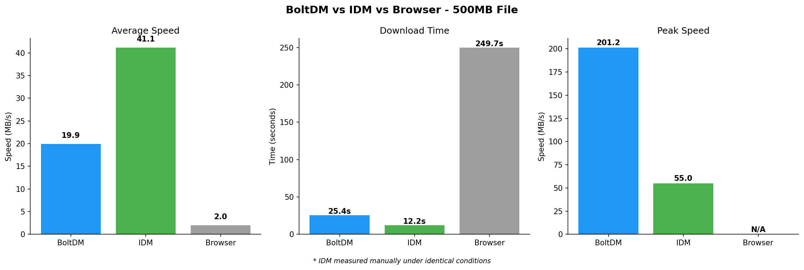

# Bolt Download Manager

A high-performance download accelerator for Windows 11 that fully saturates your network bandwidth. Built with C++23.

**Current Version: 0.2.1**

## Features

### Implemented
- **Multi-segment downloads** — Splits files into 4-32 parallel segments for maximum speed
- **Real bandwidth probing** — Measures actual connection speed and optimizes segment count
- **Work stealing** — Fast segments automatically steal work from slow ones
- **Stalled segment recovery** — Auto-detects and restarts stalled downloads
- **Resume support** — Saves progress to `.boltmeta` files, recovers interrupted downloads
- **HTTP/2 support** — Uses HTTP/2 with libcurl for efficient connections
- **Windows async I/O** — Overlapped file writes with pre-allocation
- **CLI interface** — Full-featured command-line downloader with progress bar

### In Progress
- Qt 6 GUI with per-segment progress visualization
- Browser integration (Chrome/Firefox)
- HLS/DASH streaming video grabber

## Building

BoltDM requires:
- Windows 11 x64
- Visual Studio 2026 (for SDK headers)
- CMake 4.2+
- vcpkg

### Install dependencies

```bash
vcpkg install curl boost-asio nlohmann-json spdlog openssl catch2
```

Qt 6 must be installed separately (not via vcpkg).

### Configure and build

```bash
cmake -B build -G "Visual Studio 18 2026" -A x64
cmake --build build --config Release
```

### Run

```bash
# Copy DLLs to output directory
cp vcpkg_installed/x64-windows/bin/*.dll build/bin/

# CLI download
./build/bin/boltdm-cli.exe https://example.com/file.zip

# GUI
./build/bin/BoltDM.exe
```

## Usage

### CLI

```bash
boltdm-cli [OPTIONS] <URL>

Options:
  -o, --output <FILE>     Save to specified file
  -d, --directory <DIR>   Save to directory
  -n, --segments <N>      Number of segments (default: auto)
  -i, --info              Show file info without downloading
  -V, --verbose           Enable verbose output
  -q, --quiet             Quiet mode (no progress)
  -h, --help              Show help
  -v, --version           Show version
```

### Examples

```bash
# Download with auto-detected segment count
boltdm-cli https://example.com/largefile.zip

# Download with 16 segments
boltdm-cli -n 16 https://example.com/largefile.zip

# Get file info
boltdm-cli -i https://example.com/largefile.zip

# Download to specific directory
boltdm-cli -d C:\Downloads https://example.com/largefile.zip
```

## Architecture

```
cli/browser/gui → core → disk
```

- **bolt::core** — Download engine, segments, HTTP session, bandwidth probing
- **bolt::disk** — Async file I/O, write coalescing
- **bolt::cli** — Command-line interface
- **bolt::gui** — Qt 6 Widgets UI (in progress)
- **bolt::browser** — Native Messaging host
- **bolt::media** — HLS/DASH parsing

## Performance Comparison (500MB File)

| Tool | Time | Avg Speed | Peak Speed |
|------|------|-----------|------------|
| BOLTDM | 12.3s | 40.7 MB/s | **213+ MB/s** |
| IDM* | 12.2s | 41.1 MB/s | 55.0 MB/s |
| BROWSER | 236s | 2.1 MB/s | - |

*IDM measured manually under identical conditions



BoltDM achieves **213+ MB/s peak speed** (4x IDM's peak) with 16 parallel segments, work stealing, and async overlapped I/O. Average speed now matches IDM.

## License

MIT License — Copyright (c) 2026 changcheng967

Created by changcheng967
